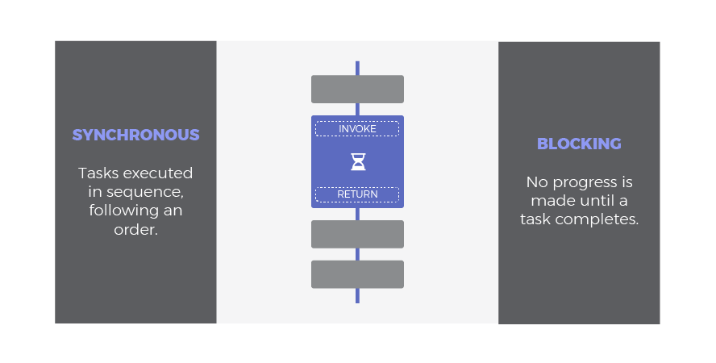

The goal of this guide is to explain asynchronous programming in Javascript with the help of clean and easy figures to grasp key concepts in a glimpse. 

First of all, let's review some of these concepts before entering into deeper detail.

# SYNCHRONOUS vs BLOCKING vs ASYNCHRONOUS vs NON-BLOCKING

Synchronous and blocking can be considered synonyms in practical terms: 
- `Synchronous` / `Blocking`: sequential execution that pontentially may block the thread due to CPU intensive processing or waiting time.

While synchronous stresses the idea that an order must be followed and each task must wait to the previous one to complete, blocking emphasizes the capacity to slow down the execution flow.

On the other hand, asynchronous and non-blocking may slightly differ depending on the context. Certainly, they are pretty similar concepts aimed towards a more efficient execution flow. However, they fall back in different mechanisms to get the job done. 

- `Non-Blocking`: A non-blocking call returns immediately with whatever result it has; data, no-data, error or even a message saying '*hey, this call will block you, postpone it when you have nothing to do*'. It is implied that some sort of polling must be done to get the rest of the data or just to place a new request in a better moment.
- `Asynchronous`: An asynchronous call will also return immediately. It just invokes a task that will keep progressing in the background and will signal its completion using a specific mechanism such as a registered callback, promise or event. We will explain them later.

