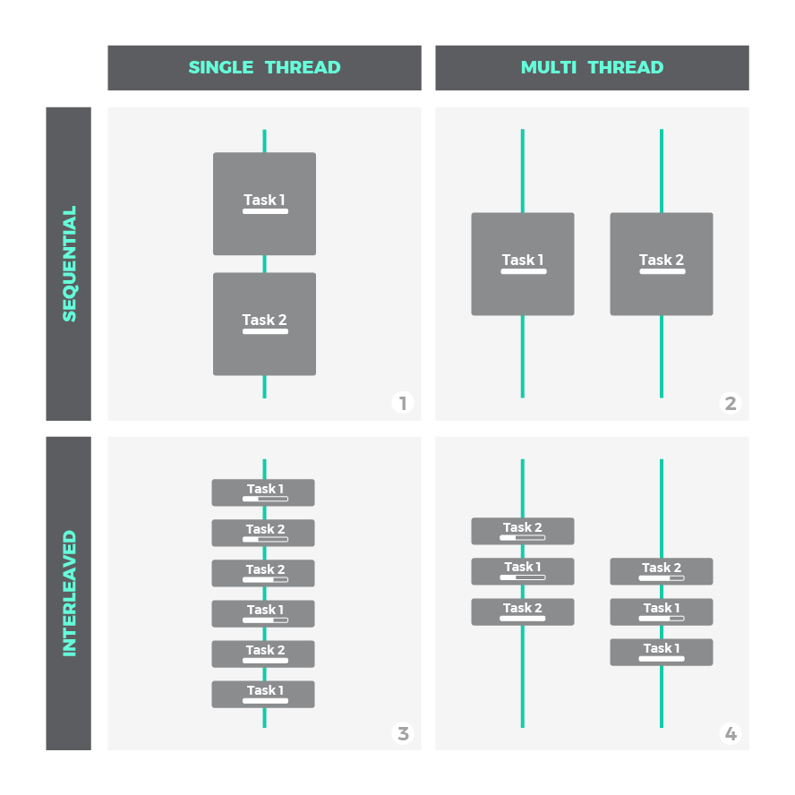

The goal of this guide is to explain asynchronous programming in Javascript with the help of clean and easy figures to grasp key concepts in a glimpse. 

First, we will review useful general ideas to better understand what's behind asynchronous programming. Then, we will move our focus to the specific Javascript scenario to verify how these concepts are applied. Finally, we will see the most common asynchronous patterns in Javascript through examples.

Let's refresh these concepts before going deeper.

# Concurrency

# Synchronous vs Blocking vs Asynchronous vs Non-blocking

Synchronous and blocking can be considered synonyms in practical terms: 
- `Synchronous` / `Blocking`: sequential execution that pontentially may block the thread due to CPU intensive processing or waiting time.

While synchronous stresses the idea that an order must be followed and each task must wait to the previous one to complete, blocking emphasizes the capacity to slow down the execution flow.

On the other hand, asynchronous and non-blocking slightly differ depending on the context. Certainly, they are pretty similar concepts aimed to improve execution flow efficiency, they use different mechanisms though:

- `Non-Blocking`: A non-blocking call returns immediately with whatever result it has; data, no-data, error or even a message saying '*hey, I will block, postpone the call*'. It is implied that some sort of polling is done to complete the job or even to place a new request in a better moment.
- `Asynchronous`: An asynchronous call will also return immediately. It just invokes a task that will keep progressing in the background and will signal its completion using a specific mechanism such as a registered callback, promise or event. We will explain them later.

