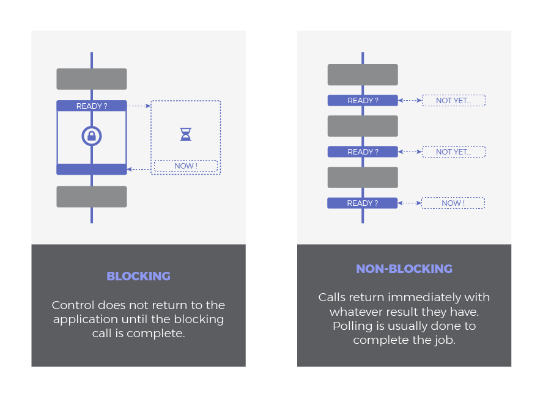

Asynchrony is one of the key features of Javascript. The goal of this guide is to go deeper into its building blocks and internals. By knowing how they work, you will be able to write better code and responsive apps. 

Explanations are supported by simple drawings to easily grasp concepts in a glimpse. First of all, we will review useful general ideas to better understand what's behind asynchronous programming. Then, we will move our focus to the specific Javascript model to verify how these concepts are applied. Finally, we will see the most common asynchronous patterns in Javascript through examples.


## Table of Contents

- [Concurrency & Parallelism](#concurrency--parallelism)
- [CPU-Bound vs I/O-Bound Operations](#cpu-bound-vs-io-bound-operations)
- [I/O Flavors: Blocking vs. Non-blocking & Synchronous vs. Asynchronous](#io-flavors-blocking-vs-non-blocking--synchronous-vs-asynchronous)
- [Javascript Model](#javascript-model)
  - [Javascript Event Loop](#javascript-event-loop)
  - [A quick note about Parallelism](#a-quick-note-about-parallelism)
- [Asynchronous Patterns in Javascript](#asynchronous-patterns-in-javascript)
  - [Callbacks](#callbacks)
- [Summary](#summary)


# Concurrency & Parallelism

Concurrency and parallelism are related concepts, very often confused, with important differences between them. A simple definition would be:

- `Concurrency`: two or more tasks make progress simultaneously. 
- `Parallelism`: tasks literally run at the same time, at the exact same instant.

While concurrency is a much broader, general problem than parallelism, the later represents a specific case of concurrency where true simultaneity happens.

Many people still believe that concurrency implies more than one thread, **this is not true**. Interleaving is a common mechanism to implement concurrency in scenarios with limited resources. Think of any modern OS trying to do multitasking in the background with a single or few cores. It just slices up concurrent tasks and interleave them, so each one will run for a short time and all of them will progress in the long term.

Let's illustrate this:


- **Scenario 1** is neither concurrent nor parallel. It is just a sequential execution, each task at a time. 
- **Scenarios 2**, **3** and **4** depict concurrency implemented under different techniques:
  - **Scenario 3** illustrates how concurrency can be achieved with a single thread. Portions of each task are interleaved to keep progress on both. This is possible as long as tasks can be decomposed into simpler subtasks.
  - **Scenarios 2** and **4** draw parallelism using multiple threads where tasks or subtasks run in parallel at the exact same time. While threads of **2** are sequential, interleaving is applied in **4**.


# CPU-Bound vs I/O-Bound Operations

So far we have seen tasks that consume CPU resources, they carry a workload (piece of code) to be executed in our application. These are called **CPU-bound** operations.

Programs, however, may also consist in reading data from disk, accessing an external database or fetching some data over the network. All these input/output operations trigger requests that are attended outside our program execution context. Therefore, **I/O-bound** operations do not '*run*' or '*execute*' in our application domain<sup id="sfootnote1">[1](#tfootnote1)</sup>. 


Bound operations also implies bottleneck with the resource is bound to. Increasing CPU resources will improve CPU-bound operations performance, while a better I/O system will boost I/O-bound operations. 

By nature, CPU-bound operations are synchronous, although interleaving or parallelism can be used to achieve concurrency. One interesting fact of I/O-bound operations is that they can be asynchronous, and, asynchrony is a very useful form of concurrency as we will see in the next section.

<sup id="tfootnote1">[1](#sfootnote1)</sup> *How and where these operations take place is out of the scope of this guide. They are enabled through APIs implemented in the browsers, and in last instance, the OS itself*.


# I/O Flavors: Blocking vs. Non-blocking & Synchronous vs. Asynchronous

This terms are not always applied consistently by every author and it depends on the context. Many times, they are used as synonyms or mixed up to refer to the same thing.

A possible classification in the context of I/O would be better understood if we imagine I/O operations comprising two phases: 
1. **Wait** for the device to be ready, I/O operation to be completed or the data to be available and then
2. **Execute** the response itself, whatever is intended to do as a response or with the received data.

Blocking vs Non-Blocking refers to how waiting time affects to our main program:

- `Blocking`: A blocking call does not return control to the application until is completed. Thread is locked by putting it to wait state.
- `Non-Blocking`: A non-blocking call returns immediately with whatever result it has. In case it could be completed, it will return the desired data. Otherwise, if the operation could not be immediately satisfied, it will provide an error code indicating something like '*Temporarily unavailable*', '*I am not ready*' or '*I will block. Please, postpone the call*'. It is implied that some sort of polling is done to complete the job or to place a new request in a better moment.



While synchronous vs asynchronous determine when does our response take place:

- `Synchronous`: blocking and synchronous are used as synonyms many times, meaning that the whole I/O operation is executed sequentially and therefore we must wait for it to complete to process the result.
- `Asynchronous`: the completion of the operation is later signaled using a specific mechanism such as a registered callback, promise or event (they will be explained later) which make possible to defer the processing of the response. Also, this is non-blocking by nature, as the I/O call returns immediately.


Combining these flavors, we can classify I/O operations:

- `Synchronous` `Blocking` I/O. The whole operation is done in one shot blocking the execution flow:
  - The thread is blocked while waiting.
  - The response is processed immediately afterwards. 
- `Synchronous` `Non-Blocking` I/O. Similar to the previous one but using any polling technique to avoid blocking in the first stage:
  - Calls returns immediately, thread not blocked. A *try later* approach may be needed.
  - The response is processed immediately when received.
- `Asynchronous` `Non-Blocking` I/O: 
  - I/O request returns immediately to avoid blocking.
  - A notification is sent once the operatino is completed. Then, a function to process the response (callback) is scheduled to be run at some point in our execution flow.


# Javascript Model

Javascript is aimed to run on browsers, dealing with network requests and user interactions at the same time, while trying to keep UI responsive. Therefore, Javascript has been intentionally evolved to be good for I/O-bound workloads. For that reason:

> **Javascript** uses an **asynchronous non-blocking model**, with a **single-threaded event loop** for its I/O interfaces.

This approach makes Javascript highly concurrent with just one thread. We already know what **asynchronous** and **non-blocking** mean but, what does *event loop* stand for? This mechanism will be explained in detail within the next chapter. First of all, let's review with all the notions learned so far, what a typical asynchronous request in Javascript looks like:


Step by step, an asynchronous I/O call can be summarized as:


## Javascript Event Loop

What happens when we run a Javascript program? How responses to asynchronous calls are treated concurrently within our program? That is exactly what the event loop model<sup id="sfootnote2">[2](#tfootnote2)</sup> answers:


+ ### Call Stack 
  It basically keeps track of where in the programm we are. Each function call enters the stack as a frame, reserving a block of memory for its arguments and local variables. If we step into a function in our program, a new frame is put on top of the stack. If we return from a function, its frame is popped out from the top. Then, it works in a LIFO fashion: last in, first out. This way, inner calls are stacked on top of its parent. The frame on the top will be attended first.


+ ### Heap
  Large unestructured memory region to dynamically allocate objects. It is shared by whole program and a *garbage collector* will make sure to free what is not used anymore. 
+ ### Queue
  Whenever an external context notify an event to our application (like in the case of asynchronous operations), it is pushed to a list of messages pending to be executed, together with its corresponding callback. A callback is just a function to be executed as a response of an event.
+ ### Event Loop
  When the call stack is emtpy, the next message in the queue is processed, this is called a '*tick*'. The processing of a message consists of calling the associated callback, and thus, creating an initial frame in the call stack. This initial frame may lead to subsequents frames. The message processing ends when the stack becomes empty again. This is called '*run-to-completion*'.


So, while the queue is the storage of external notifications and its callbacks, the event loop is the mechanism to dispatch them. This mechanism follows a synchronous fashion: each message is processed completely before any other message is processed. **Callbacks will not be fired as soon as notified**, they must wait in the queue for their turn. This waiting time will depend on the number of pending messages as well as the processing time for each one.

As we can imagine, event loop mechanism can lead to issues under the following scenarios:
- Call stack don't get empty (heavy processing) and thus, it prevents the event loop to tick.
- Multiple messages being pushed to the queue at a higher rate they are processed. 
- A message callback takes too long to finish running and stops event loop ticks. 

Most probably, **bottlenecks** are a mix of the three causes and they will end up **delaying all the execution flow**. On browsers, this means delaying renders and making the whole page seem slow. That is why the best tip in this regard is to **keep callbacks light**. Avoid code that makes your program starving of resources, let event loop to tick nicely.


<sup id="tfootnote2">[2](#sfootnote2)</sup> *What has been explained here is the theoretical model. Real implementation in Javascript engines and browsers may be heavily optimized*.

## A quick note about Parallelism

Eventhough Javascript has been designed with I/O in mind, it runs CPU intensive tasks as well. However, they can cause trouble if not handled correctly. Any processing intensive task may end up blocking our whole code execution, as explained in the previous section. 

Many efforts have been lately made to solve this issue. As a result, [WebWorkers](https://developer.mozilla.org/en-US/docs/Web/API/Web_Workers_API) and [SharedArrayBuffer](https://developer.mozilla.org/en-US/docs/Web/JavaScript/Reference/Global_Objects/SharedArrayBuffer) were recently introduced to implement parallelism. CPU intensive applications will benefit from these features by enabling heavy operations to be computed in the background, in different threads.


# Asynchronous Patterns in Javascript


## Callbacks

Callbacks are the fundamental foundation for Javascript to work asynchronously. Actually, more sofisticated asynchronous patterns are based on callbacks, they just add syntactic sugar to handle them more conveniently. 

A callback is just a function passed as an argument into another function, which will be invoked to complete some kind of action. In our asynchronous context, a callback represents the '*what do you want to do after your asynchronous operation finishes?*'. Then, it is the piece of code to be executed once the asynchronous operation has signaled its completion. The callback will be run at some future point thanks to the event loop mechanism seen before. 

Look at this simple asynchronous code using a callback:

```js
setTimeout(function(){
  console.log("I am a delayed Hello World!");
}, 1000)
```
Or if you prefer, the callback can be a named function instead of anonymous:

```js
const myCallback = () => console.log("I am a delayed Hello World!");
setTimeout(myCallback, 1000);
```

`setTimeout` is an asynchronous function that will schedule a callback to be run after a certain minimun amount of time has passed (1 second in the example above). It just fires a timer under the hood and register the callback to be run once the timer ends. In short, it delays an execution for a **minimum** time.

It is important to note that, even if we setup the delay to be 0, it does not mean the callback is run immediately. Check the following example:

```js
setTimeout(function(){
  console.log("Expected to be logged immediately");
}, 0);
console.log("Surprise!");

// Surprise!
// Expected to be logged immediately
```
Remember, the callback is added to the event loop queue and it must wait for the first tick to happen. However, the stack is busy running `console.log("Surprise!")`. Our callback will be dispatched once the stack is empty, which in practice means, once `Surprise!` has been logged.

#### Callback Hell

Callbacks also launch asynchronous calls, so they can be nested as desired. Our code can end up looking like this:

```js
setTimeout(function(){
  console.log("Stage 1 Completed");
  setTimeout(function(){
    console.log("Stage 2 Completed");
    setTimeout(function(){
      console.log("Stage 3 Completed");
      setTimeout(function(){
        console.log("Stage 4 Completed");
        // This can continue forever.
      }, 4000);
    }, 3000);
  }, 2000);
}, 1000);
```
  
This is a typical drawback of the callbacks, appart from the indentation, it reduces readability and makes code hard to maintain.


## Promises

A promise is an object that **represents the result of an asynchronous operation**. It might be available **now** or in the **future**. They are based on callbacks but add some sugar on top for a prettier syntax. Promises are special in terms of asynchrony, they add a new level of priority as we will study below.

### Consuming Promises

When calling an asynchronous function implemented with this pattern, it will immediately return a promise as a guarantee that the asynchronous operation will end up, either successfully or with failure. Once we have the promise object, we register a couple of callbacks: one to tell the promise '*what to do in case everything goes ok*' (the promise resolves) and another for '*what to do if it fails*' (the promise rejects). 

So essentially, a promise is a returned object to which we can **attach callbacks, instead of passing callbacks into a function**. The way we setup those two callbacks is by using `.then(resolveCallback, rejectCallback)`. In promise terminology we say a promise is *resolved* successfully or *rejected* with failure. Take a look at the following example:

```js
const currentURL = document.URL.toString();
const promise = fetch(currentURL);
promise.then(result => console.log(result),
  e => console.log(`Error catched:  ${e}`));
```

It is more readable in this short fashion:

```js
fetch(document.URL.toString())
  .then(result => console.log(result),
    e => console.log(`Error catched:  ${e}`));
```

In the example above, we ask the server to retrieve the current webpage using `fetch`, which is an asynchronous API returning a promise. We set it up with two callbacks, a resolve callback that will show the page through console if operation went successfully and a reject callback to simply log the error in case it fails.

One interesting feature of promises is that they can be chained. It means that a call to `.then()` will return a new promise. This new promise will be resolved with the returned value of the first `then()`'s `resolveCallback`: 

```js
fetch(document.URL.toString())
  .then(result => {
    console.log(result);
    return "First Then";
  },
    e => console.log(`Error catched:  ${e}`))
  .then(result => console.log(`Second Then after ${result}: Webpage already logged`),
    e => console.log(`Error catched:  ${e}`));
``` 

In order to avoid verbosity, we can express chained promises in a shorter way by using `catch(rejectCallback)` to catch whatever rejection occurs in any of the chained promises. `catch(rejectCallback)` is an equivalent form of `.then(null, rejectCallback)`. Only one `catch()` statement is needed at the end of a promise chain:

```js
fetch(document.URL.toString())
  .then(result => console.log(result))
  .then(() => console.log(`Fetch completed and webpage logged`))
  .catch(e => console.log(`Error catched:  ${e}`));
```

### Creating Promises 

A promise is created by instantiating a new Promise object. Upon a promise creation, a callback must be specified containing what the promise should do. This callback is passed two arguments: `resolveCallback` and `rejectCallback`. These are the two callbacks already seen before, that we setup when consuming the promise. This way, it is up to the developer to manually call `resolveCallback`() and `rejectCallback()` when needed to signal that the promise has been completed successfully or with failure. A typical squeleton of a promise could be:

```js
const myAsyncFunction = () => {
  return new Promise((resolve, reject) => {

    // Do your task here (usually an async task) and then...

    if ( /* successful condition */ ) {
      resolve(`Success!`);
    } else {
      reject(`Failure!`);
    }
  });
}
```

And a simple example like follows:

```js
const checkServer = (url) => {
  return new Promise((resolve, reject) => { 
    fetch(url)
      .then(() => resolve(`Server is ON`))
      .catch(() => reject(`Server is OFF`));
  });
}

checkServer(document.URL.toString())
  .then(result => console.log(result))
  .catch(e => console.log(e))

```

Promises are very useful to wrap up old asynchronous APIs to add a prettier syntax where a promise is returned instead of passing callbacks the old way:

```js
const delay = time => new Promise(resolveCallback => setTimeout(resolveCallback, time));

delay(3000)
  .then(() => console.log(`This is a delay of at least 3 seconds`))
  .catch(() => console.log(`Delay failed`));
```


### Asynchrony in Promises

Treating promises with the same priority as the rest of asynchronous messages will unnecessarily delay the execution of its callbacks. They could '*get lost*' among other messages such as rendering in the event loop queue. This situation may lead to break interaction with important APIs that your web application relies on. ECMAScript describes the use of a special queue, called **microtask queue**, with higher priority dedicated to promises callbacks.

The idea behind a second *high priority* queue is that every promise callback is enlisted there, so when a new event loop tick occurs, the microtask queue is attended first. This way, promises will be run later, but as soon as possible.

That is the reason why the timing of the following example is not the expected if we would only consider a single queue:

```js
// Old-style async call
setTimeout(() => console.log("1"), 0); 

// Promise-like async call
Promise.resolve().then(() => console.log("2"));

// 2
// 1
```

Promise callback `console.log("2")` has higher priority than old-style API callback `console.log("1")` thanks to the microtask queue.

## Async / Await


# Summary
- Concurrency makes tasks to progress simultaneously. Parallelism is a special case of concurrency where tasks are executed literally at the same time.
- These tasks can be CPU intensive. They are called CPU-bound operations and carry code to be run in our application. I/O-bound operations, on the other hand, do not execute in our programm flow but in an external context. They are intended to access devices or resources as servers, databases, files, etc. 
- I/O-bound operations can be blocking or non-blocking, depending on whether the thread is locked or not, and synchronous or asynchronous, in case the execution is sequential or the response comes at some point in the future.
- Javascript is intended for web applications with I/O-bound operations in mind. It uses an asynchronous non-blocking model with a single-threaded event loop.
- Event loop model allows to dispatch asynchronous notifications concurrently, but also can be exhausted and make application performance decrease if not understood correctly. Keep callbacks light.
- For those CPU intensive tasks, parallelism is slowly starting to appear in Javascript.
- Most common asynchronous patterns are:
  - Callback. Function to be run when an asynchronous operation ends.