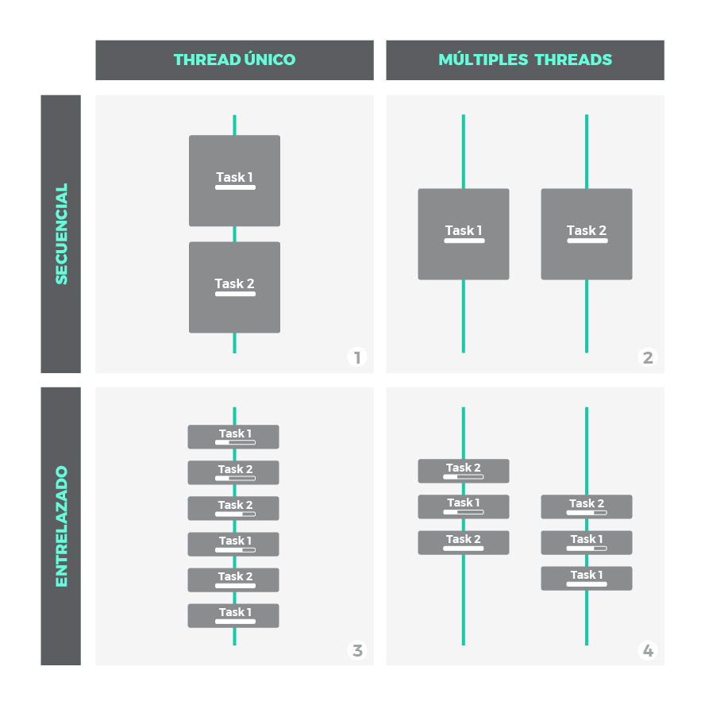
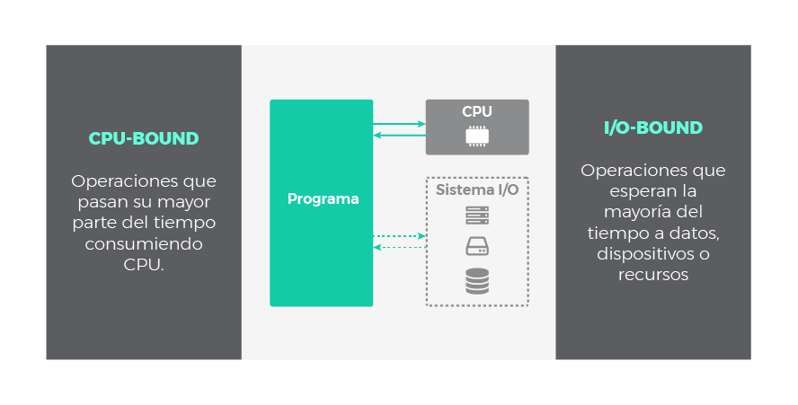
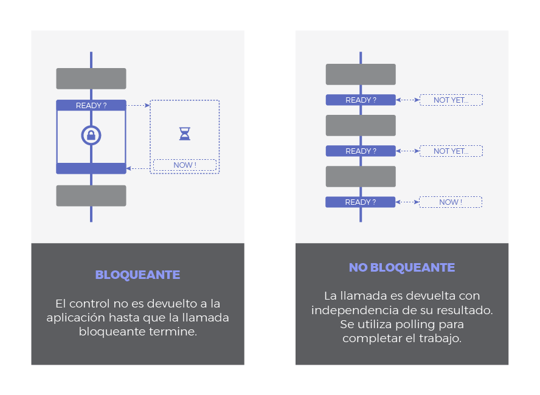
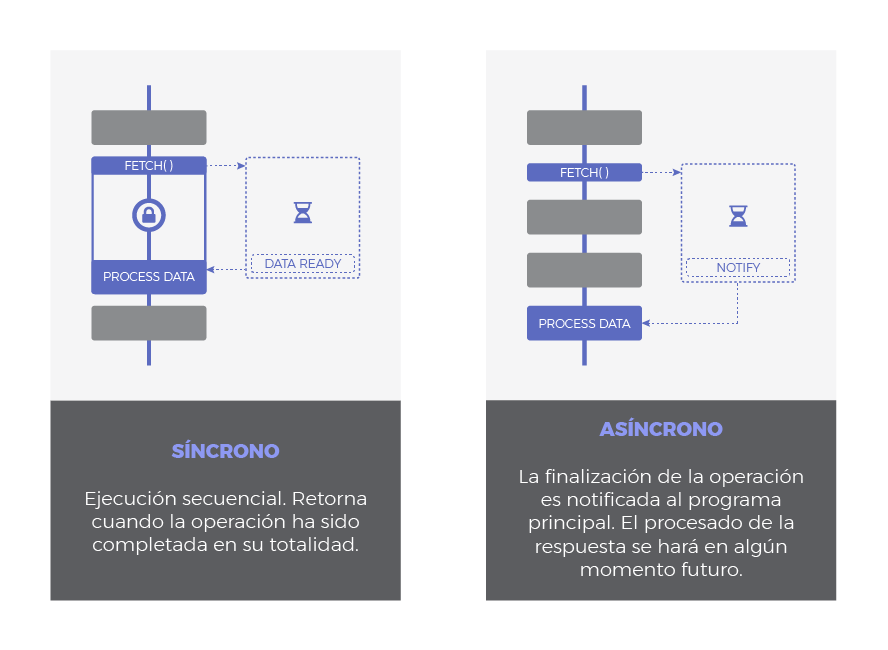
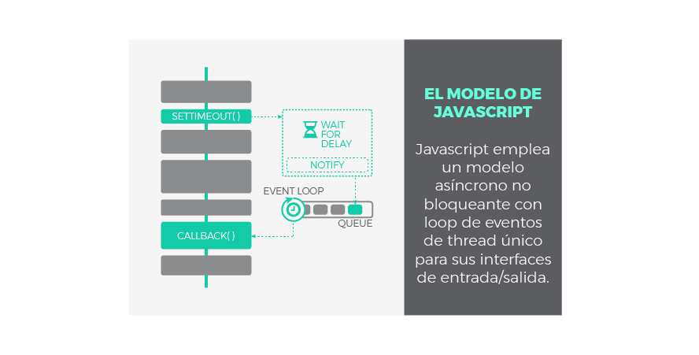
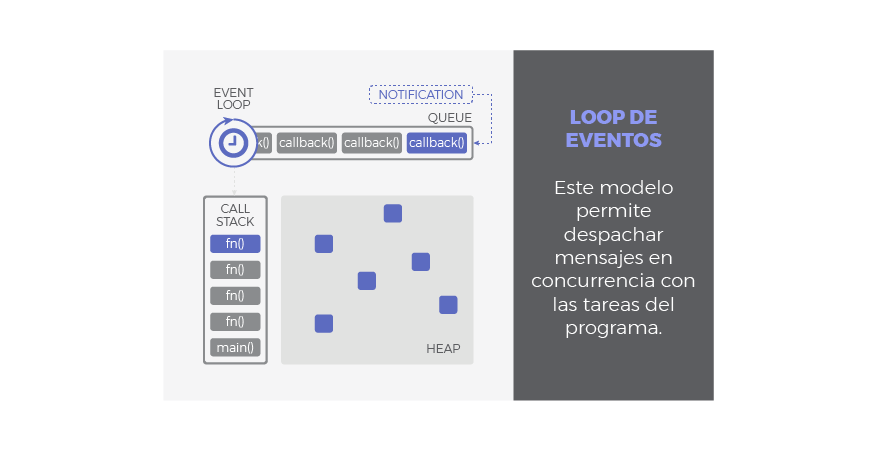

La asincronía es uno de los pilares fundamentales de Javascript. El objetivo de esta guía es profundizar en las piezas y elementos que la hacen posible. Teniendo claro estos conceptos, podrás ponerlos en práctica en tu código y escribir mejores aplicaciones.

Las explicaciones que encontrarás a continuación se apoyan gráficos sencillos pero muy ilustrativos, te ayudarán a asimilar muchas ideas. En primer lugar, trataremos conceptos generales previos como introducción a la programación asíncrona. A continuación, nos centraremos en el modelo de asincronía específico de Javascript y finalmente repasaremos los patrones asíncronos mas comunes en Javascript a través de ejemplos. 


## Tabla de Contenidos

- [Concurrencia Y Paralelismo](#concurrencia-y-paralelismo)
- [Operaciones CPU-Bound vs I/O-Bound](#operaciones-cpu-bound-vs-io-bound)
- [Naturaleza I/O: Bloqueante vs. No-bloqueante & Síncrono vs. Asíncrono](#naturaleza-io-bloqueante-vs-no-bloqueante--síncrono-vs-asíncrono)
- [El Modelo de Javascript](#el-modelo-de-javascript)
  - [El Loop de Eventos de Javascript](#el-loop-de-eventos-de-javascript)
  - [Nota breve sobre Paralelismo](#nota-breve-sobre-paralelismo)
- [Patrones Asíncronos en Javascript](#patrones-asíncronos-en-javascript)
  - [Callbacks](#callbacks)
  - [Promesas](#promesas)
  - [Async / Await](#async--await)
- [Resumen](#resumen)


# Concurrencia y Paralelismo

Concurrencia y paralelismo son conceptos relacionados pero con un importante matiz de diferencia entre ellos. Es por esto que muy a menudo se confunden y se utilizan erróneamente. Vayamos al grano:

- **`Concurrencia`**: cuando dos o mas tareas progresan simultáneamente. 
- **`Paralelismo`**: cuando dos o mas tareas se ejecutan, literalmente, a la vez, en el mismo instante de tiempo.

Nótese la diferencia: que varias tareas **progresen** simultáneamente no tiene porque significar que sucedan al mismo tiempo. Mientras que la concurrencia aborda un problema más general, el paralelismo es un sub-caso de la concurrencia donde las cosas suceden exactamente al mismo tiempo. 

Mucha gente aún sigue creyendo que la concurrencia implica necesariamente más de un *thread*. **Esto no es cierto**. El entrelazado (o multiplexado), por ejemplo, es un mecanismo común para implementar concurrencia en escenarios donde los recursos son limitados. Piensa en cualquier sistema operativo moderno haciendo multitarea con un único *core*. Simplemente trocea las tareas en tareas más pequeñas y las entrelaza, de modo que cada una de ellas se ejecutará durante un breve instante. Sin embargo, a largo plazo, la impresión es que todas progresan a la vez.

Fíjate en el siguiente gráfico:



- **Escenario 1**: no es ni concurrente ni paralelo. Es simplemente una ejecución secuencial, primero una tarea, después la siguiente. 
- **Escenario 2**, **3** y **4**: son escenarios donde se ilustra la concurrencia bajo distintas técnicas:
  - **Escenario 3**: muestra como la concurrencia puede conseguirse con un único *thread*. Pequeñas porciones de cada tarea se entrelazan para que ambas mantengan un progreso constante. Esto es posible siempre y cuando las tareas puedan descompuestas en subtareas mas simples.
  - **Escenario 2** y **4**: ilustran paralelismo, utilizando multiples *threads* donde las tareas o subtareas corren en paralelo exactamente al mismo tiempo. A nivel de *thread*, el escenario **2** es secuencial, mientras que **4** aplica entrelazado.


# Operaciones CPU-Bound vs I/O-Bound

Hasta ahora, en los ejemplos anteriores hemos visto tareas que consumían recursos de CPU. Estas tareas se componen de operaciones cuya carga (el código asociado a ellas) será ejecutada en nuestra aplicación. Se las conoce como operaciones limitadas por CPU, o en inglés, operaciones **CPU-bound**.

Sin embargo, es frecuente encontrar otro tipo de operaciones en nuestros programas, por ejemplo: leer un fichero en disco, acceder a una base de datos externa o consultar datos a través de la red. Todas estas operaciones de entrada/salida disparan peticiones especiales que son *atendidas fuera del contexto de nuestra aplicación*. Por ejemplo, desde nuestro programa se ordena la lectura de un fichero en disco, pero es el sistema operativo y el propio disco los involucrados en completar esta petición. Por lo tanto, las operaciones **I/O-bound** (limitadas por entrada/salida) no *corren* o se *ejecutan* en el dominio de nuestra aplicación.<sup id="sfootnote1">[1](#tfootnote1)</sup>. 



Cuando decimos que una operación esta limitada por algo, se desprende que existe un cuello de botella con el recurso que la limita. De este modo, si incrementamos la potencia de nuestra CPU, mejoraremos el rendimiento de las operaciones *CPU-bound*, mientras que una mejora en el sistema de entrada/salida favorecerá el desempeño de las operaciones *I/O-bound*.

La naturaleza de las operaciones *CPU-bound* es intrínsecamente síncrona (o secuencial, si la CPU esta ocupada no puede ejecutar otra tarea hasta que se libere) a menos que se utilicen mecanismos de concurrencia como los vistos anteriormente (entrelazado o paralelismo por ejemplo). ¿Qué sucede con las operaciones *I/O-bound*? Un hecho interesante es que pueden ser asíncronas, y la asincronía es una forma muy útil de concurrencia que veremos en la siguiente sección.

<sup id="tfootnote1">[1](#sfootnote1)</sup> *Como y dónde tienen lugar estas operaciones esta fuera del ámbito de esta guia. Sucede a través de APIs implementadas en los navegadores y, en última isntancia, del propio sistema operativo.*.


# Naturaleza I/O: Bloqueante vs. No-bloqueante & Síncrono vs. Asíncrono

Estos términos no siempre son aplicados de forma consitente y dependerá del autor y del contexto. Muchas veces se utilizan como sinónimo o se mezclan para referirse a lo mismo. 

Una posible clasificación en el contexto *I/O* podría hacerse si imaginamos las operaciones I/O comprendidas en dos fases:
1. **Fase de Espera** a que el dispositivo este listo, a que la operación se complete o que los datos esten disponibles.
2. **Fase de Ejecución** entendida como la propia respuesta, lo que sea que quiera hacerse como respuesta a los datos recibidos.

Bloqueante vs No-bloqueante hace referencia a como la fase de espera afecta a nuestro programa:

- **`Bloqueante`**: Una llamada u operación bloqueante no devuelve el control a nuestra aplicación hasta que se ha completado. Por tanto el *thread* queda bloqueado en estado de espera.
- **`Non-Blocking`**: Una llamada no bloqueante devuelve inmediatamente con independencia del resultado. En caso de que se haya completado, devolverá los datos solicitados. En caso contrario (si la operación no ha podido ser satisfecha) podría devolver un código de error indicando algo asi como '*Temporalmente no disponible*', '*No estoy listo*' o '*En este momento la llamada sería bloqueante. Por favor, postponga la llamada*'. En este caso se sobreentiende que algún tipo de *polling* debería hacerse para completar el trabajo o para lanzar una nueva petición más tarde, en un mejor momento.



Síncrono vs Asíncrono se refiere a cuando tendrá lugar la respuesta:

- **`Síncrono`**: es frecuente emplear 'bloqueante' y 'síncrono' como sinónimos, dando a entender que toda la operación de entrada/salida se ejecuta de forma secuencial y, por tanto, debemos esperar a que se complete para procesar el resultado.
- **`Asíncrono`**: la finalización de la operación *I/O* se señaliza más tarde, mediante un mecanismo específico como por ejemplo un *callback*, una promesa o un evento (se explicarán después), lo que hace posible que la respuesta sea procesada en diferido. Como se puede adivinar, su comportamiento es no bloqueante ya que la llamda *I/O* devuelve inmediatamente.




Según la clasificación anterior, podemos tener operaciones *I/O* de tipo:

- `Síncronas` y `Bloqueantes`. Toda la operación se hace de una vez, bloqueando el flujo de ejecución:
  - El *thread* es bloqueado mientras espera.
  - La respuesta se procesa inmediatamente después de terminar la operación. 
- `Síncronas` y `No-Bloqueantes`. Similar a la anterior pero usando alguna técnica de *polling* para evitar el bloqueo en la primera fase:
  - La llamada devuelve inmediatamente, el *thread* no se bloquea. Se necesitarán sucesivos intentos hasta completar la operación.
  - La respuesta se procesa inmediatamente después de terminar la operación.
- `Asíncronas` y `No-Bloqueantes`: 
  - La petición devuelve inmediatamente para evitar el bloqueo.
  - Se envía una notificación una vez que la operación se ha completado. Es entonces cuando la función que procesará la respuesta (*callback*) se encola para ser ejecutada en algún momento en nuestra aplicación.


# El Modelo de Javascript

Javascript fue diseñado para ser ejecutado en navegadores, trabajar con peticiones sobre la red y procesar las interacciones de usuario, al tiempo que se mantiene una interfaz fluida. Ser bloqueante o síncrono no ayudaría a conseguir estos objetivos, es por ello que Javascript ha evolucionado intencionadamente pensando en operaciones de tipo *I/O*. Por esta razón:

> **Javascript** utiliza un modelo **asíncrono y no bloqueante**, con un ***loop* de eventos implementado con un único *thread*** para sus interfaces de entrada/salida.

Gracias a esta solución, Javascript es áltamente concurrente a pesar de emplear un único *thread*. Ya conocemos el significado de *asíncrono* y *no bloqueante*, pero ¿qué es el *loop* de eventos? Este mecanismo será explicado en el siguiente capítulo. Antes, a modo de repaso, veamos el aspecto de una operación *I/O* asíncrona en Javascript:



Paso a paso, podría explicarse del siguiente modo:


## El *Loop* de Eventos de Javascript

¿Cómo se ejecuta un programa en Javascript? ¿Como gestiona nuestra aplicación de forma concurrente las respuestas a las llamadas asíncronas? Eso es exactamente lo que el modelo basado en un *loop* de eventos<sup id="sfootnote2">[2](#tfootnote2)</sup> viene a responder:



+ ### *Call Stack*
  Traducido, pila de llamadas, se encarga de albergar las instrucciones que deben ejecutarse. Nos indica en que punto del programa estamos, por donde vamos. Cada llamada a función de nuestra aplicación, entra a la pila generando un nuevo *frame* (bloque de memoria reservada para los argumentos y variables locales de dicha función). Por tanto, cuando se llama a una función, su *frame* es insertado arriba en la pila, cuando una función se ha completado y devuelve, su *frame* se saca de la pila también por arriba. El funcionamiento es LIFO: *last in, first out*. De este modo, las llamadas a función que están dentro de otra función contenedora son apiladas encima y serán atendidas primero.


+ ### *Heap*
  Región de memoria libre, normalmente de gran tamaño, dedicada al alojamiento dinámico de objetos. Es compartida por todo el programa y controlada por un recolector de basura que se encarga de liberar aquello que no se necesita. 
+ ### Cola o *Queue*
  Cada vez que nuestro programa recibe una notificación del exterior o de otro contexto distinto al de la aplicación (como es el caso de operaciones asíncronas), el mensaje se inserta en una cola de mensajes pendientes y se registra su *callback* correspondiente. Recordemos que un *callback* era la función que se ejecutará como respuesta.
+ ### *Loop* de Eventos
  Cuando la pila de llamadas (*call stack*) se vacía, es decir, no hay nada más que ejecutar, se procesan los mensajes de la cola. Con cada '*tick*' del bucle de eventos, se procesa un nuevo mensaje. Este procesamiento consiste en llamar al *callback* asociado a cada mensaje lo que dará lugar a un nuevo *frame* en la pila de llamadas. Este *frame* inicial puede derivar en muchos más, todo depende del contenido del *callback*. Un mensaje se termina de procesar cuando la pila vuleve a estar vacía de nuevo. A este comportamiento se le conoce como '*run-to-completion*'.


De esta forma, podemos entender **la cola como el almacén de los mensajes (notificaciones) y sus *callbacks* asociados** mientras que **el loop de eventos es el mecanismo para despacharlos**. Este mecanismo sigue un comportamiento síncrono: cada mensaje debe ser procesado de forma completa para que pueda comenzar el siguiente.

Una de las implicaciones más relevants de este bucle de eventos es que **los *callbacks* no serán despachados tan pronto como sean encolados**, sino que deben esperar su turno. Este tiempo de espera dependerá del numero de mensajes pendientes de procesar (por delante en la cola) así como del tiempo que se tardará en cada uno de ellos. Aunque pueda parecer obvio, esto explica la razón por la cual la finalización de una operacion asíncrona no puede predecirse con seguridad, sino que se atiende en modo *best effort*. 

El *loop* de eventos no está libre de problemas, y podrían darse situaciones comprometidas en los siguientes casos:
- La pila de llamadas no se vacía ya que nuestra aplicación hace uso intensivo de ella. No habrá *tick* en el bucle de eventos y por tanto los mensajes no se procesan.
- El flujo de mensajes que se van encolando es mayor que el de mensajes procesados. Demasiados eventos a la vez. 
- Un *callback* requiere procesamiento intensivo y acapara la pila. De nuevo bloqueamos los *ticks* del bucle de eventos y el resto de mensajes no se despachan.

Lo más probable es que un cuello de botella se produzca como consecuencia de una mezcla de factores. En cualquier caso, acabarían **retrasando el flujo de ejecución**. Y por tanto retrasando el renderizado, el procesado de eventos, etc. La experiencia de usuario se degradaría y la aplicación dejaría de responder de forma fluida. Para evitar esta situación, recuerda siempre **mantener los *callbacks* lo más ligeros posible**. En general, evita código que acapare la CPU y permite que el *loop* de eventos se ejecute a buen ritmo.


<sup id="tfootnote2">[2](#sfootnote2)</sup> *El *loop* de eventos que aquí se explica es un modelo teórico. La implementación real en navegadores y motores de Javascript está muy optimizada y podría ser distinta*.

## Nota breve sobre Paralelismo

Aunque Javascript ha sido concebido con las operaciones de entrada/salida en mente, no significa que no pueda ejecutar tareas de procesado intesivo. Por supuesto que puede hacerlo, pero si no se manejan adecuadamente, podría dar lugar a los problemas mencionados en el apartado anterior.

Se ha invertido un considerable esfuerzo ultimamente para minimizar estos problemas. Como resultado, entidades como los [WebWorkers](https://developer.mozilla.org/en-US/docs/Web/API/Web_Workers_API) y los [SharedArrayBuffer](https://developer.mozilla.org/en-US/docs/Web/JavaScript/Reference/Global_Objects/SharedArrayBuffer han visto la luz recientemente para introducir el paralelismo en Javascript. Si necesitas ejecutar tareas pesadas que hagan un uso intensivo de CPU deberías considerar el uso de WebWorkers que corran en segundo plano consumiendo *threads* distintos al principal.


# Patrones asíncronos en Javascript


## *Callbacks*

Los *callbacks* son la pieza clave para que Javascript pueda funcionar de forma asíncrona. De hecho, el resto de patrones asíncronos en Javascript está basado en *callbacks* de un modo u otro, simplemente añaden azúcar sintáctico para trabajar con ellos más cómodamente. 

Un *callback* no es más que **una función que se pasa como argumento de otra función**, y que será invocada para completar algún tipo de acción. En nuestro contexto asíncrono, un *callback* representa el '*¿Qué quieres hacer una vez que tu operación asíncrona termine?*'. Por tanto, es el trozo de código que será ejecutado una vez que una operación asíncrona notifique que ha terminado. Esta ejecución se hará en algún momento futuro, gracias al mecanismo que implementa el bucle de eventos. 

Fíjate en el siguiente ejemplo sencillo utilizando un callback:

```js
setTimeout(function(){
  console.log("Hola Mundo con retraso!");
}, 1000)
```
Si lo prefieres, el callback puede ser asignado a una variable con nombre en lugar de ser anónimo:

```js
const myCallback = () => console.log("Hola Mundo con retraso!");
setTimeout(myCallback, 1000);
```

`setTimeout` es una función asíncrona que programa la ejecución de un *callback* una vez ha transcurrido, como mínimo, una determinada cantidad de tiempo (1 segundo en el ejemplo anterior). A tal fin, dispara un *timer* en un contexto externo y registra el *callback* para ser ejecutado una vez que el timer termine. En resumen, retrasa una ejecución, como **mínimo**, la cantidad especificada de tiempo.

Es importante comprender que, incluso si configuramos el retraso como 0ms, no significa que el *callback* vaya a ejecutarse inmediatamente. Atento al siguiente ejemplo:

```js
setTimeout(function(){
  console.log("Esto debería aparecer primero");
}, 0);
console.log("Sorpresa!");

// Sorpersa!
// Esto debería aparecer primero
```
Recuerda, un *callback* que se añade al *loop* de eventos debe esperar su turno. En nuestro ejemplo, el *callback* del `setTimeout` debe esperar el primer *tick*. Sin embargo, la pila esta ocupada procesando la línea `console.log("Sorpresa!")`. El *callback* se despachará una vez la pila quede vacía, en la práctica, cuando `Sorpresa!` haya sido logueado.

#### *Callback Hell*

Los *callbacks* también pueden lanzar a su vez llamadas asíncronas, asi que pueden anidarse tanto como se desee. Inconveniente, podemos acabar con código como este:

```js
setTimeout(function(){
  console.log("Etapa 1 completada");
  setTimeout(function(){
    console.log("Etapa 2 completada");
    setTimeout(function(){
      console.log("Etapa 3 completada");
      setTimeout(function(){
        console.log("Etapa 4 completada");
        // Podríamos continuar hasta el infinito...
      }, 4000);
    }, 3000);
  }, 2000);
}, 1000);
```
Éste es uno de los inconvenientes clásicos de los *callbacks*, además de la indentación, resta legibilidad, dificulta su mantenimiento y añade **complejidad ciclomática**. Al *Callback Hell** también se le conoce como **Pyramid of Doom** o **Hadouken**.


## Promesas

Una promesa es un objeto que representa **el resultado de una operación asíncrona**. Este resultado podría estar disponible **ahora** o en el **futuro**. Las promesas se basan en **callbacks** pero añaden azúcar para un mejor manejo y sintaxis. Las promesas son especiales en términos de asincronía ya que añaden un nuevo nivel de prioridad que estudiaremos a continuación.


### Consumiendo Promesas

Cuando llamamos a una función asíncrona implementada con este patrón, nos devolverá inmediatamente una promesa como garantía de que la operación asíncrona finalizará en algún momento, ya sea con éxito o con fallo. Una vez que tengamos el objeto promesa en nuestro poder, registramos un par de *callbacks*: uno para indicarle a la promesa '*que debe hacer en caso de que todo vaya bien*' (resolución de la promesa o *resolve*) y otro para determinar '*que hacer en caso de fallo*' (rechazo de la promesa o *reject*). 

A resumidas cuentas, una promesa es un objeto al que le **adjuntamos *callbacks*, en lugar de pasarlos directamente a la función asíncrona**. La forma en que registramos esos dos **callbacks* es mediante el método `.then(resolveCallback, rejectCallback)`. En terminología de promesas, decimos que una promesa se resuelve con éxito (*resolved*) o se rechaza con fallo (*rejected*). Echa un vistazo al siguiente ejemplo:

```js
const currentURL = document.URL.toString();
const promise = fetch(currentURL);
promise.then(result => console.log(result),
  e => console.log(`Error capturado:  ${e}`));
```

Es más legible si lo expresamos de la siguiente manera:

```js
fetch(document.URL.toString())
  .then(result => console.log(result),
    e => console.log(`Error capturado:  ${e}`));
```

En el ejemplo anterior, pedimos al servidor que nos provea una URL utilizando la función asíncrona `fetch` y nos devuelve una promesa. Configuramos la promesa con dos callbacks: uno para resolver la promesa, que mostrará la página por consola en caso de éxtio, y otro para rechazarla en caso de fallo que mostrará el error asociado.

Una característica interesante de las promesas es que pueden ser encadenadas. Esto es posible gracias a que la llamada `.then()` también devuelve una promesa. Esta nueva promesa devuelta será resuelta con el valor que retorne el *callback* de resolución original (el que hemos pasado al primer `then()`): 

```js
fetch(document.URL.toString())
  .then(result => {
    console.log(result);
    return "Primer Then";
  },
    e => console.log(`Error capturado:  ${e}`))
  .then(result => console.log(`Segundo Then despues de ${result}: La página ya ha debido ser mostrada`),
    e => console.log(`Error capturado:  ${e}`));
``` 

Para evitar verbosidad, podemos encadenar las promesas de un modo mas corto, empleando el método `.catch(rejectCallback)` para catpurar cualquier rechazo que ocurra en cualesquiera de las promesas encadenadas. `catch(rejectCallback)` es equivalente a `.then(null, rejectCallback)`. Solo se necesita una única sentencia `catch()` al final de una cadena de promesas:

```js
fetch(document.URL.toString())
  .then(result => console.log(result))
  .then(() => console.log(`Fetch completado, página mostrada`))
  .catch(e => console.log(`Error capturado:  ${e}`));
```

### Creando Promesas

Una promesa se crea instanciando un nuevo objeto `Promise`. En el momento de la creación, en el constructor, debemos especificar un *callback* que contenga la carga de la promeas, aquello que la promesa debe hacer. Este *callback* nos provee de dos argumentos: `resolveCallback` y `rejectCallback`. Te suenan, ¿verdad? Son los dos mismos *callbacks* registrados al consumir la promesa. De este modo, depende de ti como desarrollador llamar a `resolveCallback` y `rejectCallback` cuando sea necesario para señalizar que la promesa ha sido completada con éxito o con fallo.

Una plantilla típica para la creación de promesas es la siguiente:

```js
const myAsyncFunction = () => {
  return new Promise((resolve, reject) => {

    // Carga de la promesa (normalmente tareas asíncronas).

    if ( /* evalúa condición */ ) {
      resolve(`Éxito!`);
    } else {
      reject(`Fallo!`);
    }
  });
}
```

Un ejemplo sencillo podría ser:

```js
const checkServer = (url) => {
  return new Promise((resolve, reject) => { 
    fetch(url)
      .then(response => resolve(`Estado del Servidor: ${response.status === 200 ? "OK" : "NOT OK"}`))
      .catch(() => reject(`Error al localizar URL`));
  });
}

checkServer(document.URL.toString())
  .then(result => console.log(result))
  .catch(e => console.log(e));

```

Las promesas son muy útiles para envolver antiguas APIs asíncronas que funcionan a través de *callbacks* puros. De esta forma podemos hacerlas funcionar via promesas:

```js
const delay = time => new Promise(resolveCallback => setTimeout(resolveCallback, time));

delay(3000)
  .then(() => console.log(`Este es un retardo de al menos 3 segundos`))
  .catch(() => console.log(`Retardo fallido`));
```


### Asincronía en Promesas

Si tratásemos las promesas con la misma prioridad que el resto de mensajes asíncronos, retrasariamos innecesariamente la ejecución de sus *callbacks*. Podrían acabar '*perdiéndose*' entre otros mensajes en la cola de eventos, como por ejemplo mensajes de renderizado o eventos de usuario. Dado que las promesas suelen ser fruto de la interacción con importantes APIs asíncronas, y por tanto, son una parte importante de la que se sirve tu aplicación, no queremos que se retrasen. Es preferible darles una prioridad mayor. El estándar ECMAScript describe el uso de una cola especial, llamada *cola de microtareas* o **microtask queue**, con una mayor prioridad dedicada a la gestión de *callbacks* de promesas.

La idea detrás de una segunda cola de *alta prioridad* es que los *callbacks* de cada promesa se almacenen aquí, de modo que cuando un nuevo *tick* del bucle de eventos tenga lugar, esta cola prioritaria será atendida primero. Asi pues, nos aseguramos que los *callbacks* de las promesas se ejecutarán en un futuro, si, **pero lo antes posible**. 

Por este motivo, las trazas del siguiente ejemplo aparecen en un orden inesperado si sólo considerasemos una única cola:

```js
// LLamada asíncrona con callback puro.
setTimeout(() => console.log("1"), 0); 

// LLamada asíncrona con promesa.
Promise.resolve().then(() => console.log("2"));

// 2
// 1
```

El *callback* de la promesa (`() => console.log("2")`) tiene mayor prioridad que el *callback* del `setTimeout` gracias a la cola de microtareas, y por ello es procesado primero.


## Async / Await

Las promesas supusieron un gran salto en Javascript al introducir una mejora sustancial sobre los *callbacks* y un manejo más elegante de nuestras tareas asíncronas. Sin embargo, también pueden llegar a ser tediosas y verbosas a medida que se requieren más y más `.then()`. **Las palabras clave `async` y `await` surgieron para simplificar el manejo de las promesas**. Son puro azúcar para hacer las promesas más amigables, escribir código más sencillo, reducir el anidamiento y mejorar la trazabilidad al depurar. Pero recuerda, `async \ await` y las promesas son lo mismo en el fondo.

La etiqueta `async` declara una función como asíncrona e indica que una promesa será automáticamente devuelta. Podemos declarar como `async` tanto funciones con nombre, anónimas, o funciones flecha. Por otro lado, `await` debe ser usado siempre dentro de una función declarada como `async` y esperará automáticamente (de forma asíncrona y no bloqueante) a que una promesa se resuelva.

Mucho mejor si vemos un ejemplo:

```js
const checkServerWithSugar = async (url) => {
  const response = await fetch(url);
  return `Estado del Servidor: ${response.status === 200 ? "OK" : "NOT OK"}`;
}

checkServerWithSugar(document.URL.toString())
  .then(result => console.log(result));

```

Compara este ejemplo con la versión original de `checkServer` que hemos visto en la sección [Promesas](#promesas). Son equivalentes, en esta nueva versión sin embargo, la sentencia `await` se encargará automáticamente de gestionar la promesa devuelta por `fetch`. Esta promesa es transparente a nosotros, pero está siendo configurada de modo que su `resolveCallback` equivale a las líneas de código que hay posteriores al `await` (en este caso solo dos, la asignación a `response` y la última línea con el `return`. Es decir, todo lo que queda por ejecutar en nuestra función `async` será usado como el `resolveCallback` de la promesa del `fetch`. Esto es, el resto de nuestra función `async` se ejecutará asíncronamente una vez que la promesa del `fetch` se resuelva, sin necesidad de *callbacks*, con nuestro código escrito de forma secuencial. Casi magia. 

En la práctica, este comportamiento es equivalente a decir que el operador `await` '*pausa la ejecución*' o '*espera a una promesa*'. Probablemente hayas leído esta definición en algún sitio, pero cuidado con los matices, ya que sugiere la idea errónea de que `await` bloquea o espera de forma síncrona, y no, no lo hace. 

### Manejo de Errores

Si una promesa gestionada por `await` es rechazada o un error se dispara dentro de la función declarada como `async`, la promesa que automáticamente devuelve la función `async` también será rechazada. En este caso, podemos encadenar un `.catch()` para notificar el error:

```js
checkServerWithSugar(document.URL.toString())
  .then(result => console.log(result))
  .catch(e => console.log(`Error Capturado Fuera de la función async: ${e}`));
```

Pero si necesitáramos gestionar estos erroes internamente, en la propia función `async`, deberemos envolver nuestro código con un `try / catch` del siguiente modo:

```js
const checkServerWithSugar = async (url) => {
  try {
    const response = await fetch(url);
    return `Estado del servidor: ${response.status === 200 ? "OK" : "NOT OK"}`;
  } catch (e) {
    throw `Manejo intero del error. Error original: ${e}`;
  }
}

checkServerWithSugar(document.URL.toString())
  .then(result => console.log(result))
  .catch(e => console.log(`Error Capturado Fuera de la función async: ${e}`));
```

### Multiples awaits

La mayoría de las veces querrás evitar apilar sentencias `await`, a menos que una dependa de la otra. Apilar multiples `await` es equivalente a lanzar una promesa cuando la anterior haya sido resuelta. 

Mira el siguiente ejemplo:

```js
async function wait() {
  await delay(500);
  await delay(500);
  return "Ha transcurrido, como mínimo, 1 segundo.";
};
``` 

Solo cuando el primer `delay()` haya sido resuelto, se llamará al segundo `delay()`. Apilar varios `await` implica una espera síncrona entre ellos. Sin embargo, si hacemos lo siguiente:

```js
async function wait() {
  const d1 = delay(500);
  const d2 = delay(500);
  await d1;
  await d2;
  return "Ha transcurrido, como mínimo, 500ms.";
};
```

Es una solución mucho más interesante ya que ambas llamadas a `delay()` serán iniciadas y nos quedamos a la espera de su resolución. De este modo, permitimos que las llamadas asíncronas a `delay()` sucedan de forma concurrente y progresen a la vez. 


# Resumen
- La concurrencia hace que las tareas progresen simultáneamente. El paralelismo es un caso especial de concurrencia donde las tareas se ejecutan literalmente al mismo tiempo.
- Estas tareas pueden consumir CPU de forma intensiva. Se las conoce como operaciones *CPU-bound* y llevan código que se ejecuta en nuestra aplicación. Por contra, las operaciones *I/O-bound* no son ejecutadas en el flujo de nuestro programa sino en un contexto externo. Estas operaciones persiguen el acceso a dispositivos o recursos como servidores, bases de datos, ficheros, etc.
- Las operaciones *I/O-bound* (de entrada/salida) pueden ser bloqueantes o no bloqueantes, en función de si el *thread* queda a la espera o no, y síncronas o asíncronas, según si la ejecución es secuencial o la respuesta puede darse en diferido, en algún momento en el futuro.
- Javascript está diseñado para aplicaciones web, enfocado hacia operaciones *I/O-bound*. Utiliza un modelo asíncrono y no bloqueante con un *loop* de eventos de un único *thread*.
- Este modelo permite despachar mensajes asíncronos de forma concurrente, pero cuidado, si no se utiliza convenientemente podemos reducir considerablemente el desempeño de nuestra aplicación. Mantén tus *callbacks* todo lo ligeros que te sea posible.
- Para aquellas tareas pesadas que requieran un procesamiento intensivo utiliza el paralelismo en Javascript a través de los WebWorkers.
- Los patrones asíncronos más comunes en Javascript son: 
  - *Callback*. Función que se ejecuta cuando una operación asíncrona termina, como resultado de la misma.
  - Promesa. Representa el resultado de una operación asíncrona. Se configura con dos *callbacks* para resolver la promesa con éxito o con fallo.
  - Async/Await. Azúcar sintáctico para manejar promesas de una forma más simple. *Async* declara una función como asíncrona mientras que *await* gestiona la resolución de una promesa de forma automática. *Await* debe emplearse siempre dentro de declaraciones *async*.
  